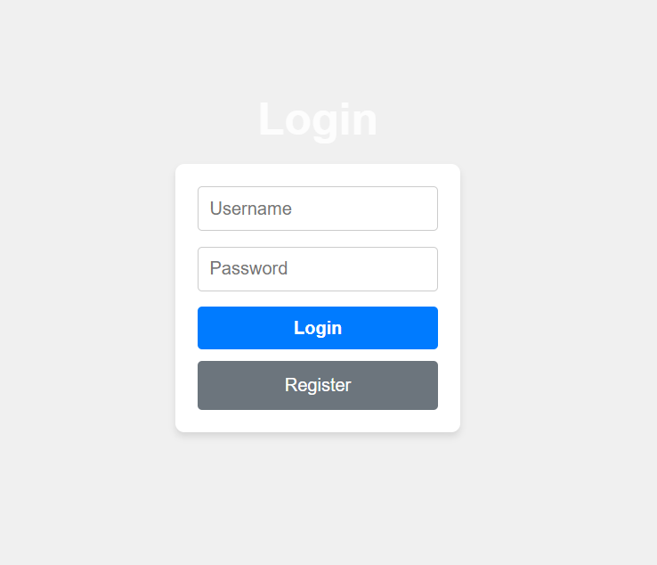
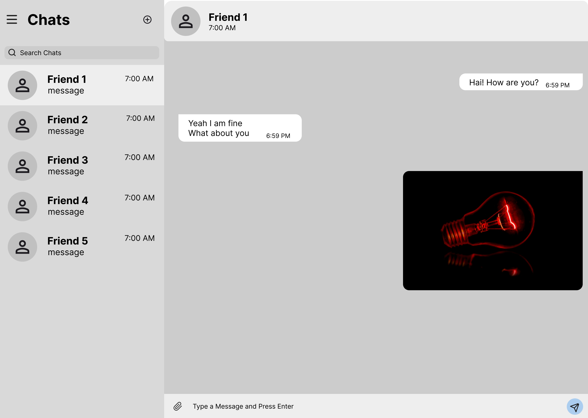

# 📌 Real-Time Chat App - Frontend

Welcome to the **Real-Time Chat Application** frontend! This repository contains the client-side code, built with modern web technologies to deliver a seamless and dynamic messaging experience.

## 🚀 Features

✅ **Real-Time Messaging** – Instant communication using WebSockets (Socket.io).  
✅ **Modern UI/UX** – A sleek, responsive design with smooth animations.  
✅ **User Authentication** – Secure login and registration with JWT-based authentication.  
✅ **Media Sharing** – Send and receive images, videos, and documents.  

---

## 🛠️ Tech Stack

- **React.js** – Frontend framework for building an interactive UI.
- **Socket.io Client** – Enables real-time communication with the backend.

---

## 🎯 Installation & Setup

Follow these steps to set up and run the frontend locally:

### 1️⃣ Clone the Repository
```sh
git clone https://github.com/yourusername/real-time-chat-app-frontend.git
cd real-time-chat-app-frontend
```

### 2️⃣ Install Dependencies
```sh
npm install
```

### 3️⃣ Configure Environment Variables
Create a `.env` file in the root directory and add the required environment variables.

### 4️⃣ Start the Development Server
```sh
npm run dev
```
The app will be running at: `http://localhost:5173/`

---

## 📂 Project Structure
```
frontend/
│-- public/             # Static assets
│-- src/
│   │-- assets/         # Images, icons, and static files
│   │-- components/     # Reusable UI components
│   │-- constants/      # Constant values used in the project
│   │-- CSS/            # Stylesheets for the application
│   │-- pages/          # Application pages (Chat, Login, Register, etc.)
│   │-- App.css         # Global styles for the app
│   │-- App.jsx         # Main application file
│   │-- index.css       # Index styles
│   │-- main.jsx        # Entry point for React
│-- .gitignore          # Files to ignore in version control
│-- eslint.config.js    # ESLint configuration file
│-- index.html          # Main HTML file
│-- package.json        # Dependencies and scripts
│-- package-lock.json   # Lock file for dependencies
│-- README.md           # This documentation
│-- vite.config.js      # Vite configuration file
```

---

## 📌 Key Functionalities

### 🔹 User Authentication
- Sign up and login authentication.
- Secure passwords.

### 🔹 Real-Time Messaging
- WebSocket-based instant chat.
- Optimized event handling with Socket.io.

---

## 📸 Screenshots



---

## 🛠️ Deployment
To deploy the frontend, build the production version and serve it:
```sh
npm run build
```
Then, host it using Vercel, Netlify, or any static site hosting service.

---

## 🤝 Contributing
We welcome contributions! If you’d like to improve the project, feel free to:
- Fork the repository
- Create a feature branch
- Submit a pull request

---

### 💬 Have Questions?
For any issues or suggestions, feel free to open an issue or reach out!

---

🌟 **Star this repo if you found it useful!** 🚀

